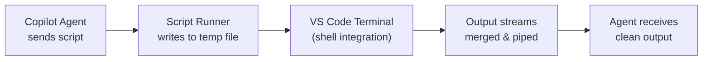

# Copilot Script Runner

[](https://marketplace.visualstudio.com/items?itemName=bdayadev.copilot-script-runner)
[](https://open-vsx.org/extension/bdayadev/copilot-script-runner)
[](https://opensource.org/licenses/MIT)

**The missing piece for GitHub Copilot's terminal execution.** Run multi-line scripts reliably with proper output capture, pager bypass, and cross-shell support.

---

## The Problem

GitHub Copilot's built-in `run_in_terminal` tool has limitations that cause frustration:

### 🔴 Multi-line Output Is Truncated

```powershell
# When run_in_terminal executes this:
echo "Line 1"
echo "Line 2"
echo "Line 3"
```

The terminal runs the entire script, but **only the first line's output is returned to the AI agent**. The agent thinks "Line 1" is all that happened and misses everything else.

### 🔴 Pagers Block Execution

Commands like `gcloud --help`, `kubectl describe`, or `git log` open interactive pagers (`less`, `more`) that hang forever waiting for user input.

### 🔴 Output Streams Get Lost

Error streams, warnings, and verbose output often don't make it back to the AI agent.

---

## The Solution

**Copilot Script Runner** solves all of these by:

1. ✅ **Writing scripts to temp files** — No parsing or escaping issues
2. ✅ **Merging all output streams** — Errors, warnings, and stdout all captured
3. ✅ **Bypassing pagers automatically** — `gcloud --help` works without hanging
4. ✅ **Supporting multiple shells** — PowerShell, WSL, and Git Bash

---

## Quick Start

Install the extension, then in GitHub Copilot Chat:

```text
Use #runScript to check my gcloud configuration
```

```text
Use #runScript with shell="wsl" to run a Linux deployment script
```

```text
Use #runScript with shell="bash" to run commands on this Linux remote
```

The AI agent will use the appropriate shell to execute your commands reliably.

---

## Tools Provided

### `#runScript` — Unified Script Runner

Executes scripts with full stream capture. Supports multiple shells via the `shell` parameter:

| Shell | Description |
| ----- | ----------- |
| `powershell` | PowerShell (default on Windows) |
| `bash` | Native Bash (Linux/macOS/Remote SSH) |
| `wsl` | Windows Subsystem for Linux |
| `gitbash` | Git Bash on Windows |
| `zsh` | Z shell |
| `fish` | Fish shell |

**PowerShell Example:**
```powershell
# Works perfectly:
gcloud projects list
kubectl get pods --all-namespaces
git log --oneline -20

# Complex multi-line scripts:
$services = Get-Service | Where-Object Status -eq 'Running'
foreach ($svc in $services) {
    Write-Host "$($svc.Name): $($svc.Status)"
}
```

**Bash Example (via WSL, Git Bash, or native):**
```bash
# Works on any platform:
uname -a
docker ps
kubectl apply -f manifests/

# Git operations:
git status
git log --oneline -10
```
- `wsl` — Windows Subsystem for Linux
- `gitbash` — Git Bash on Windows

### `#scriptRunnerVersion` — Version Info

Returns the currently installed version of the extension. Useful for debugging.

```text
Use #scriptRunnerVersion to check the installed version
```

### `#getScriptOutput` — Retrieve Terminal Output

Retrieves output from a Script Runner terminal by its ID. Essential for checking results of background processes.

```text
Use #getScriptOutput with id="a8cc5ce0" to check the server output
```

> **Note:** This tool uses Script Runner's terminal IDs (returned by `#runScript`), not VS Code's built-in terminal IDs.

---

## Parameters

### #runScript

| Parameter | Type | Default | Description |
| ----------- | ------ | --------- | ------------- |
| `script` | string | *required* | The script to execute |
| `shell` | `"powershell"` \| `"bash"` \| `"wsl"` \| `"gitbash"` \| `"zsh"` \| `"fish"` | `"powershell"` | Which shell to use |
| `isBackground` | boolean | `false` | Return immediately for long-running processes |
| `timeoutMs` | number | — | Timeout in milliseconds |
| `keepScript` | boolean | `false` | Keep the temp file for debugging |
| `workingDirectory` | string | cwd | Directory to run the script in |

---

## Background Processes

For long-running commands like servers or watch tasks, use background mode:

```text
Use #runScript with isBackground=true to start the dev server
```

The tool returns immediately with a **Terminal ID**. The process continues running in the VS Code terminal, and you can check output later using VS Code's `get_terminal_output` tool with the returned ID.

---

## Terminal Management

The extension intelligently manages terminals:

- **Reuses idle terminals** — Avoids spawning a new terminal for every command
- **Names terminals by shell type** — e.g., "Script Runner (pwsh)", "Script Runner (wsl)"
- **Returns Terminal ID** — Every execution returns a unique ID for tracking
- **Cleans up automatically** — Temp script files are deleted after execution (unless `keepScript=true`)

---

## Remote SSH Support

The extension works with VS Code Remote SSH:

```text
Use #runScript with shell="bash" to run commands on the remote server
```

When connected to a remote host:

- Scripts are written to the **remote** temp directory
- Bash executes **on the remote server**
- Output is captured and returned to the agent

**Recommended shell settings for remote:**

| Platform | Shell Parameter |
| -------- | --------------- |
| Linux remote | `shell="bash"` |
| macOS remote | `shell="bash"` or `shell="zsh"` |
| Windows remote with WSL | `shell="wsl"` |
| Windows remote with Git Bash | `shell="gitbash"` |

---

## How It Works



### Technical Details

**PowerShell:** Commands are wrapped with `*>&1 | Out-Host` to:

- Merge all 6 PowerShell streams into stdout
- Stream output in real-time (no buffering)
- Allow progress bars and Write-Progress to display correctly

**WSL:** Commands run inside `wsl bash -c '...'` to ensure:

- Proper path translation (Windows → Linux)
- Correct redirection (`2>&1` happens in Bash, not PowerShell)

**Git Bash:** Uses `$env:ProgramFiles\Git\bin\bash.exe` with similar wrapping.

---

## Requirements

- **VS Code** 1.100.0 or higher
- **GitHub Copilot** extension
- **For Bash scripts:** WSL or Git Bash installed

---

## Installation

### VS Code Marketplace

1. Open VS Code
2. Press `Ctrl+Shift+X` to open Extensions
3. Search for **"Copilot Script Runner"**
4. Click **Install**

### Open VSX (for VSCodium)

1. Open Extensions
2. Search for **"Copilot Script Runner"** by bdayadev
3. Click **Install**

---

## Troubleshooting

### "Shell integration not available"

The extension requires VS Code's shell integration feature. Make sure:

- You're using a supported shell (PowerShell 7+, Bash, Zsh)
- Shell integration is enabled in VS Code settings

### "WSL not found"

Install Windows Subsystem for Linux:

```powershell
wsl --install
```

### "Git Bash not found"

Install [Git for Windows](https://git-scm.com/download/win) which includes Git Bash.

### Output contains escape sequences

This is normal for colored output. The raw terminal codes are preserved. Future versions may add an option to strip ANSI codes.

---

## Contributing

Contributions welcome!

1. Fork the [repository](https://github.com/Bdaya-Dev/copilot-script-runner)
2. Create a feature branch
3. Make your changes
4. Submit a Pull Request

---

## License

MIT License — see [LICENSE](LICENSE) for details.

---

## Related Issues

This extension addresses problems documented in these VS Code GitHub issues:

| Issue | Title | Reactions |
| ----- | ----- | --------- |
| [#253265](https://github.com/microsoft/vscode/issues/253265) | Agent/Chat extension cannot see terminal command output | 👍 19 |
| [#282904](https://github.com/microsoft/vscode/issues/282904) | Copilot misses last lines of output (Git Bash + WSL) | — |
| [#259328](https://github.com/microsoft/vscode/issues/259328) | run_in_terminal fails to capture output (Windows) | 👍 1 |
| [#261691](https://github.com/microsoft/vscode/issues/261691) | run_in_terminal fails to capture stdout from CLI tools | — |
| [#261585](https://github.com/microsoft/vscode/issues/261585) | GitHub Copilot Chat Not Capturing Terminal Output | 👍 2 |
| [#252524](https://github.com/microsoft/vscode/issues/252524) | Copilot agent can't see run_in_terminal output (WSL) | — |
| [#269724](https://github.com/microsoft/vscode/issues/269724) | Terminal output capture drops last line (Cygwin) | 👍 1 |
| [#273753](https://github.com/microsoft/vscode/issues/273753) | Terminal stuck after pager (less) | — |

If you're experiencing any of these issues, **Copilot Script Runner** provides a reliable workaround by writing scripts to temp files and using VS Code's shell integration for proper output capture.

---

Made with ❤️ by [Bdaya Dev](https://github.com/Bdaya-Dev)
